# 🏘️ Property Management Application

A **centralized, end-to-end Property Lifecycle Management (PLM) solution** designed to consolidate and automate the
tracking, updating, and coordination of your entire **property portfolio** across various regions and client accounts.

This platform delivers a single source of verified truth for all assets, ensuring maximum operational efficiency,
preventing data fragmentation, and providing the comprehensive control necessary to manage complex property flows with
confidence and full regulatory adherence.

---

## 🚀 Live Demo & Access

Experience the application's functionality directly!

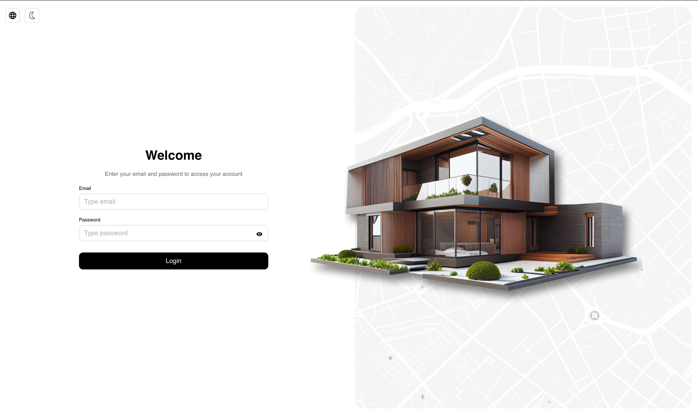

- **Live Demo Link:** https://map-markers-ed36e.web.app

### Test Credentials

> Use these **test credentials** to explore the application's functionality.
>
> - **Email:** `user@test.com`
> - **Password:** `User1!`

---

## ⚙️ Technical Stack

This project was built using a modern and robust stack to ensure a fast, scalable, and maintainable application,
emphasizing code quality, strong typing, and superior user experience.

### Core Technologies

- **Frontend Framework:** **React** with **Vite** for a fast, component-based user interface and rapid compilation.
- **Backend & Database:** **Firebase** (Firestore & Authentication) for serverless management, real-time data
  synchronization, and user sign-in.
- **Serverless Logic:** **Firebase Functions** utilized for executing complex, centralized CRUD operations and managing
  cross-instance database changes efficiently.
- **Testing:** **Vitest** for running comprehensive unit tests and functional tests.
- **DevOps (CI/CD):** **GitHub Actions** utilized for automated Continuous Integration and Continuous Deployment
  pipelines. **Critical API keys and environment variables** required for deployment to Firebase Hosting and Functions
  are secured via **GitHub Secrets**, ensuring stability and preventing the exposure of sensitive credentials in the
  codebase.
- **Code Quality Enforcement:** **Husky** pre-commit hooks are configured to automatically run code formatting and
  linting checks before every commit, ensuring consistent code style and preventing common errors from entering the
  repository.

### Design, Code Quality & UI/UX Libraries

- **Design Process:** The application's UI/UX was planned using **Figma**, where a **custom design** was created in
  close collaboration with a dedicated UX team to optimize user flows and accessibility.
- **Language & Typing:** The entire codebase is implemented in **TypeScript**, ensuring full type safety, reducing
  runtime errors, and improving long-term maintainability.
- **Design System:** A **custom-built Design System** was created for the application, establishing a unified library of
  all basic components (buttons, inputs, navigation, etc.) to ensure visual consistency and development efficiency.
- **Styling:** **Styled-Components** were used for component-level styling, facilitating dynamic theming and
  encapsulated CSS.
- **Forms & Validation:** Implemented **React Hook Form** for efficient form handling, coupled with **Zod** for robust,
  TypeScript-first schema validation.
- **Mapping:** **Leaflet** integrated for dynamic and interactive map rendering to display property locations.
- **Localization:** **i18next** is used to manage and deliver the multi-language capabilities of the platform (English
  and Italian).

---

## 🎨 Visuals & Accessibility

The platform offers a refined user experience, designed for both aesthetic appeal and high-level accessibility.

- **High Accessibility Standard (WCAG 2.2):** The application was built to be fully accessible, meeting the guidelines
  set by the **Web Content Accessibility Guidelines (WCAG) 2.2**.
- **Full Keyboard Navigation:** All interactive elements (forms, buttons, menus) are fully operable using only the
  _keyboard_ (`Tab`, `Enter`, etc.). This ensures compliance and provides a seamless experience for users relying on
  screen readers.
- **Responsive Design:** The application features a fully responsive design, ensuring a seamless and optimized
  experience across all screen sizes, including **mobile phones** and **tablets**.

  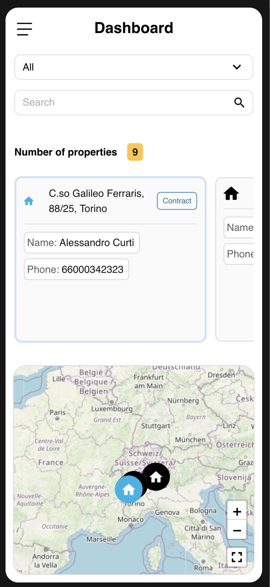
  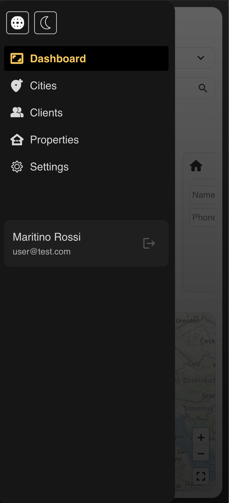
  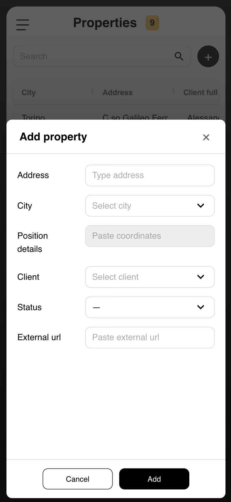

### Quality Metrics

The commitment to best practices and performance is validated by testing scores:

### User Experience Features

- **Multilingual Support:** The entire application is translated into both **English** and **Italian**, catering
  specifically to the primary Italian customer base.

- **Color Palette:** Features both a **Light Mode** and a **Dark Mode** to enhance user accessibility and preference,
  particularly for prolonged use.

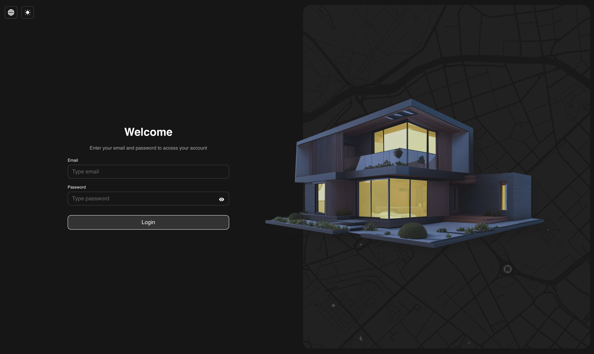
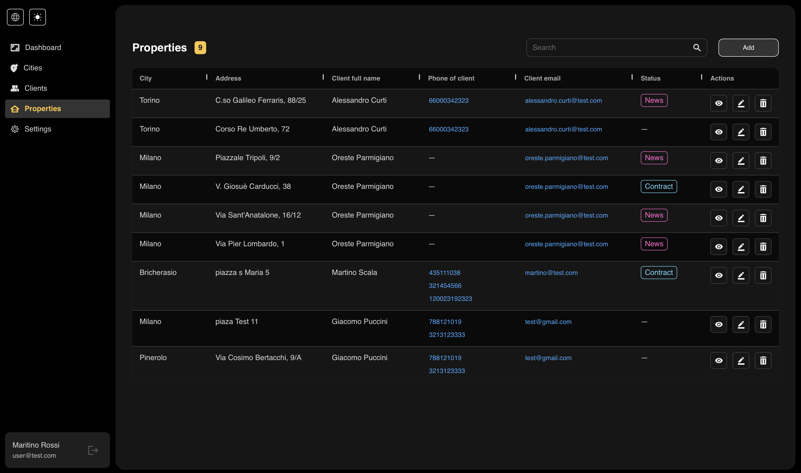

---

## ✨ Core Functionality: CRUD Management

The application provides robust tools for complete lifecycle management of key resources: **Cities**, **Clients**,
and \*
\*Properties\*\*. All data is managed through secure and validated forms, ensuring data integrity.

### 1. Full Lifecycle Management (CRUD)

Users can seamlessly perform all necessary operations through intuitive forms and interfaces:

- **Create:** Easily add new **Properties**, **Clients**, or define new operational **Cities**.

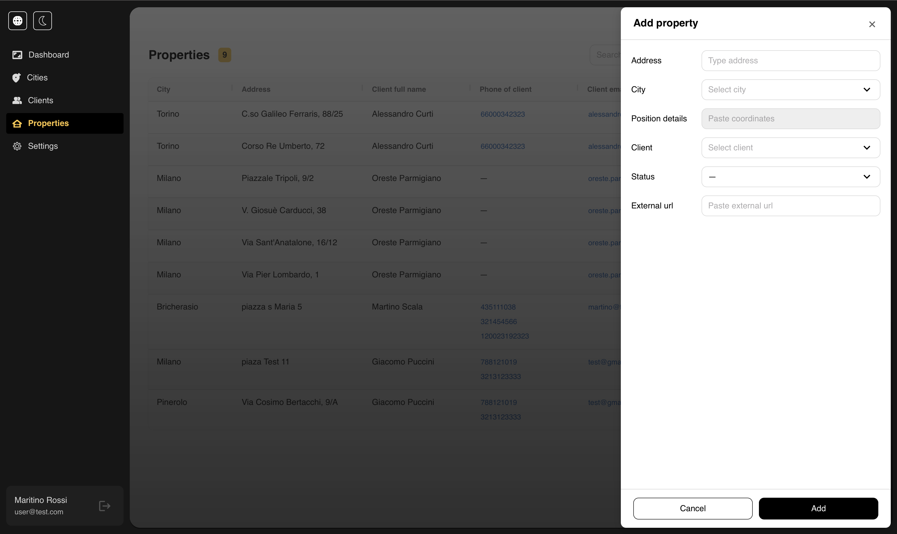

- **Modify:** Update any existing record. For Properties, all details from client assignment to geographical address can
  be changed.

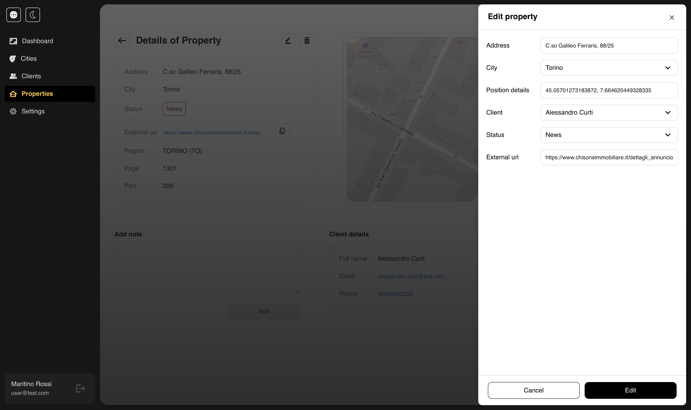

- **Delete:** Safely remove items. A confirmation flow ensures accidental deletions are prevented.

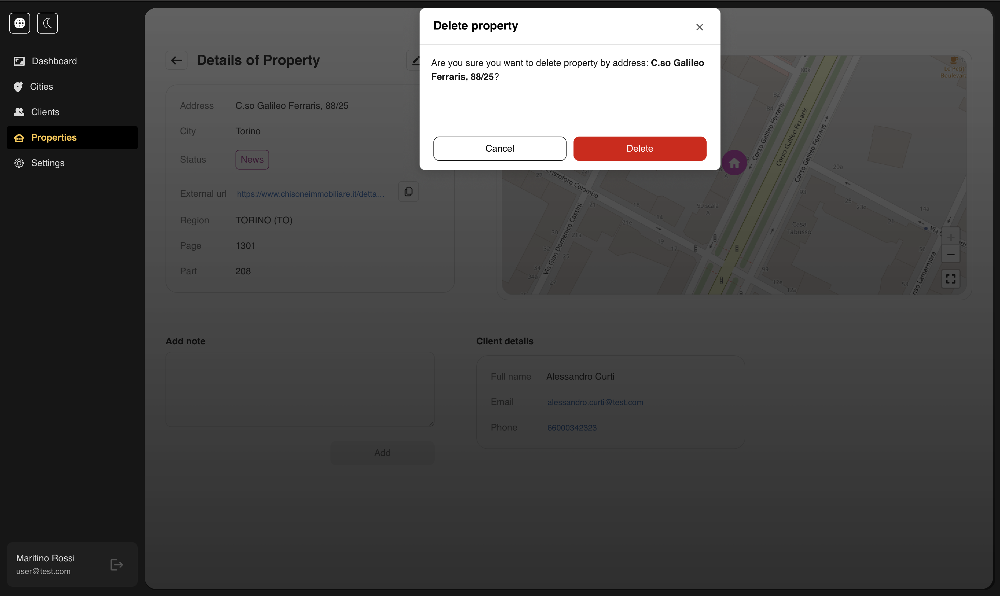

### 2. Cross-Instance Data Consistency (UPDATE Logic)

A critical feature of the system is maintaining data consistency across the entire database, which is handled via
Firebase Functions.

> **Example:** If a user modifies the **address** of a Property, the system automatically triggers a serverless function
> that updates that new address across **every other instance** where this Property is referenced (e.g., in the
> associated
> Client's property list, or the City's property count). This prevents data drift and ensures a single source of truth.

### 3. Robust Form Validation

All data input points are protected by rigorous validation to maintain data quality:

- **Real-time Feedback:** Forms provide immediate feedback on invalid or missing data fields.
- **Custom Rules:** Validation checks include specific rules for emails, required fields, and data type consistency
  before any changes are submitted to the database.

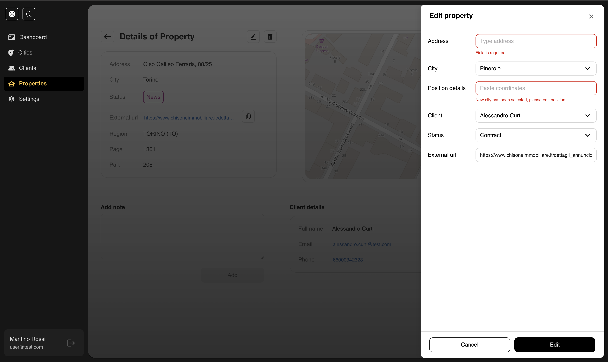

### Property Status Workflow

The platform allows users to track the status of properties through different lifecycle stages, enabling efficient
workflow coordination and clear oversight.

- **Dynamic Status Updates:** Easily track and update a property's status (e.g., **"News", "Contract"**)
  directly from the interface.

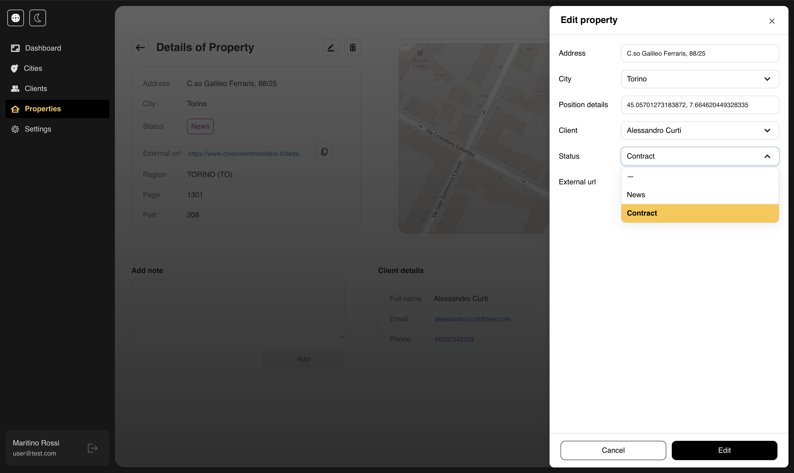

- **Instant Visual Feedback:** Upon successful modification of a property's status, a **toast notification** provides
  immediate and clear visual confirmation of the update, ensuring the user is always informed.

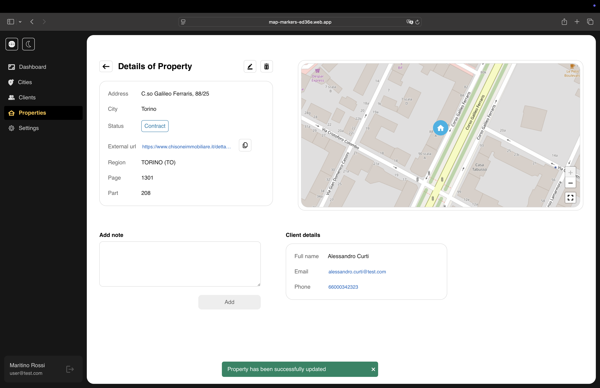

---

## 🔗 External API Integration: Cadastral Data

A key feature enhancing the application's real-world utility is the integration with a dynamic, open-source instance
providing official Italian land registry data.

- **Source of Truth:** The system dynamically retrieves and displays **official Catasto (Italian Land Registry) data**
  for managed properties.
- **Data Points:** This integration provides critical, official information, including:
  - The corresponding **City** and **Province** (e.g., TORINO (TO)).
  - Specific cadastral references (**Foglio** and **Particella**) required for official documentation and
    transactions.

This ensures that all property records within the application are verified against official, external data,
significantly reducing manual data entry errors.

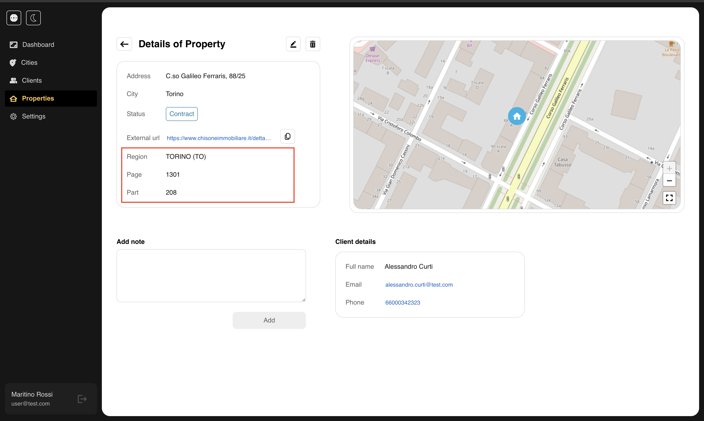

